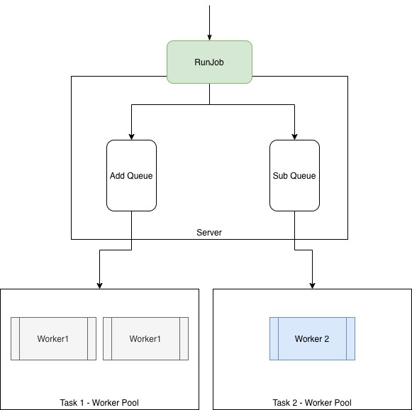

# Task Queue in Golang

The example for task queue in Golang without any dependences.



## The Conception

- Server: manage task and worker
- Worker: the task worker
- Worker Pool: in the same worker pool, the worker's capability is same.

## Workflow

The workflow in main

### 1. Init

- create a server for managing task and worker
- create 2 workers for `add` tasks
- create 1 workers for `sub` tasks

### 2. Run task

Create 10 tasks to run.

## Run code and Result

```bash
go run .
```

Result

```
2020/06/27 21:12:02 DEBUG: worker=add-worker-1 result=100
2020/06/27 21:12:02 result: 100
2020/06/27 21:12:02 DEBUG: worker=sub-worker-0 result=-99
2020/06/27 21:12:02 result: -99
2020/06/27 21:12:02 DEBUG: worker=add-worker-0 result=102
2020/06/27 21:12:02 result: 102
2020/06/27 21:12:02 DEBUG: worker=sub-worker-0 result=-97
2020/06/27 21:12:02 result: -97
2020/06/27 21:12:02 DEBUG: worker=add-worker-1 result=104
2020/06/27 21:12:02 result: 104
2020/06/27 21:12:02 DEBUG: worker=sub-worker-0 result=-95
2020/06/27 21:12:02 result: -95
2020/06/27 21:12:02 DEBUG: worker=add-worker-0 result=106
2020/06/27 21:12:02 result: 106
2020/06/27 21:12:02 DEBUG: worker=sub-worker-0 result=-93
2020/06/27 21:12:02 result: -93
2020/06/27 21:12:02 DEBUG: worker=add-worker-1 result=108
2020/06/27 21:12:02 result: 108
2020/06/27 21:12:02 DEBUG: worker=sub-worker-0 result=-91
2020/06/27 21:12:02 result: -91
```